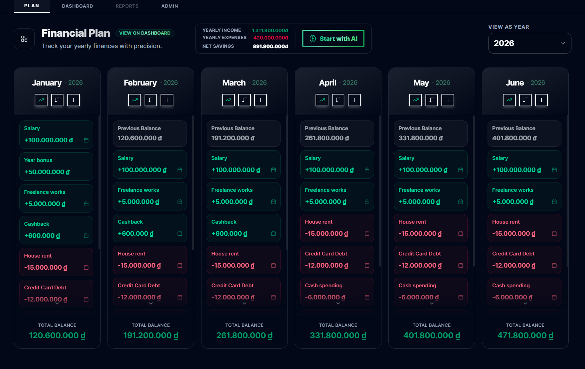
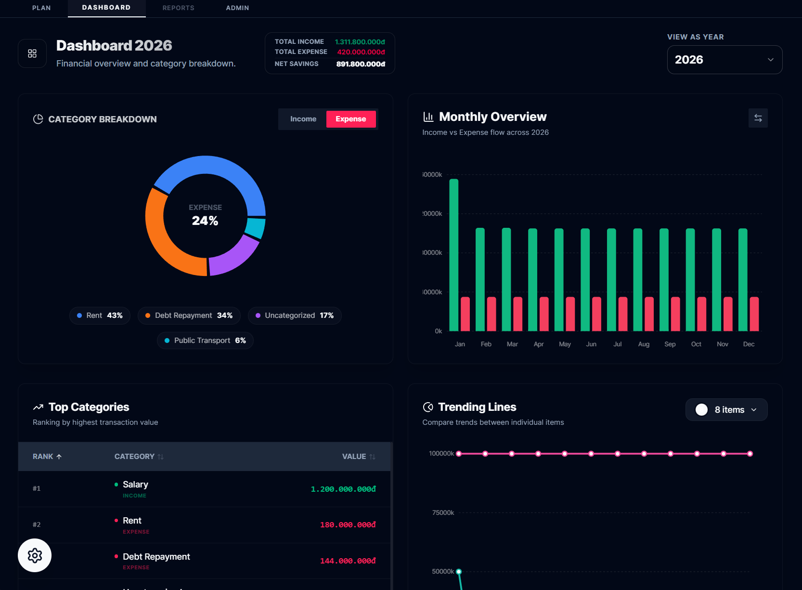

# Plan Your Money

Plan Your Money is a financial planning and management application built with React, Vite, and TypeScript. It focuses on long-term financial projection and budget planning.

## Preview


*Main application UI for yearly budget planning.*


*Visual charts for financial plan analysis.*


## Features

- Multi-currency support (VND, USD, AUD) with real-time conversion.
- Automated exchange rate fetching with 24-hour local caching.
- Data visualization for monthly trends, category breakdowns, and top expenses.
- AI integration for automated financial planning and categorization.
- Bilingual support (English and Vietnamese) via CSV-based translation system.
- Local-first data persistence.
- Modern UI with dark mode and responsive layouts.

## Technical Stack

- React 19 / Vite / TypeScript
- Tailwind CSS / Lucide Icons
- Recharts for data visualization
- Playwright for end-to-end testing
- ESLint / PostCSS

## Directory Structure

- `src/components`: UI components grouped by feature (Plan, Dashboard, Admin).
- `src/services`: Core logic for calculations, currency, and AI.
- `src/providers`: React Context providers for global state.
- `src/hooks`: Application hooks for i18n and data access.
- `src/types`: TypeScript definitions.
- `i18n/`: CSV translation files.

## Getting Started

### Prerequisites

- Node.js (Latest LTS)
- npm or equivalent package manager

### Installation

1. Install dependencies:
   ```bash
   npm install
   ```

2. Configuration:
   Create a `.env` file in the root directory based on `.env.example`.

### Development

Start the local development server:
```bash
npm run dev
```

### Production Build

Build the application for production:
```bash
npm run build
```

### Testing

Execute end-to-end tests:
```bash
npm run app-tests
```

## License

Private - All rights reserved.
